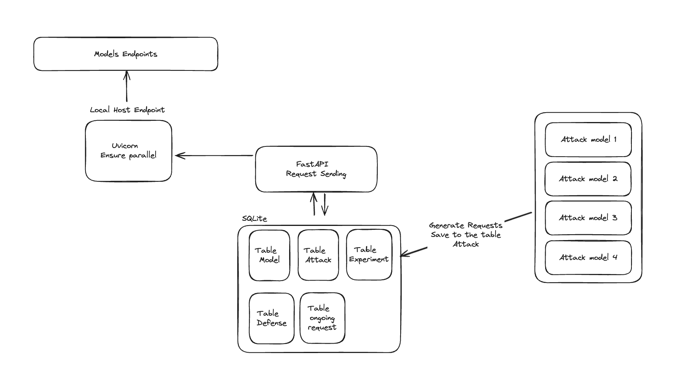

# Adversarial-Attacks-on-LLM

# Architect


# Pre-Project 

```shell
# Install all dependencies specified in pyproject.toml
poetry install

# Activate the virtual environment created by Poetry
poetry shell 

# Configure Poetry to create the virtual environment within the project directory
poetry config virtualenvs.in-project true

```

# Run-time

```shell
# Put your token in the .env or export to env variable
DB_PATH="sql/chat_requests.db"
OPENAI_API_KEY=your_openai_api_key_here
CLAUDE_API_KEY=your_claude_api_key_here
LLAMA_API_URL=your_llama_api_url_here

# Start the FastAPI application using Uvicorn with auto-reload enabled for development
uvicorn src.main:app --reload

# Run the test-connection script to check API connections and validate the API token
# This script can help ensure that the API is reachable and correctly secured
sh src/test-connection.sh

```


# Data model

---

### 1. `chat_requests` 表

此表用于存储聊天请求信息，包括模型名称、提示输入、状态、响应以及相关方法的类别信息。

| 字段名            | 数据类型 | 描述                                                     |
|-------------------|----------|----------------------------------------------------------|
| `id`              | INTEGER  | 主键，自增                                               |
| `model_name`      | TEXT     | 模型名称，引用 `Models` 表中的 `model_name`              |
| `prompt_input`    | TEXT     | 要发送的 `prompt` 内容                                   |
| `status`          | TEXT     | 请求的状态（如 `pending`, `completed`）                  |
| `response`        | TEXT     | 模型的回复                                               |
| `method_used`     | TEXT     | 方法名称，引用 `Attacks` 表中的 `paper_name`             |
| `method_category` | TEXT     | 方法类别，引用 `Attacks` 表中的 `attack_category`        |
| `answer_category` | TEXT     | 模型回复的类别（如 `good`, `bad`）                       |

---

### 2. `Attacks` 表

此表用于存储攻击方法的信息，`attack_prompt` 字段将作为 `prompt_input`，`paper_name` 用于 `method_used`，`attack_category` 用于 `method_category`。

| 字段名            | 数据类型 | 描述                                                     |
|-------------------|----------|----------------------------------------------------------|
| `id`              | INTEGER  | 主键，自增                                               |
| `paper_name`      | TEXT     | 方法的名称，作为 `method_used`                            |
| `attack_category` | TEXT     | 方法的类别，作为 `method_category`                        |
| `attack_prompt`   | TEXT     | 要作为 `prompt_input` 的内容                              |

---

### 3. `Defenses` 表

此表用于存储防御方法的信息，每条记录描述一种防御措施。

| 字段名            | 数据类型 | 描述                                                     |
|-------------------|----------|----------------------------------------------------------|
| `id`              | INTEGER  | 主键，自增                                               |
| `name`            | TEXT     | 防御方法的名称                                           |
| `category`        | TEXT     | 防御方法的类别（如 `Self-Processing`, `Additional Helper`）|
| `description`     | TEXT     | 防御方法的详细描述                                       |

---

### 4. `Models` 表

此表用于存储模型的信息，包括名称、API 端点和参数。`model_name` 与 `chat_requests` 表的 `model_name` 一致。

| 字段名          | 数据类型 | 描述                                                     |
|-----------------|----------|----------------------------------------------------------|
| `id`            | INTEGER  | 主键，自增                                               |
| `model_name`    | TEXT     | 模型名称，引用 `chat_requests` 表中的 `model_name`       |
| `endpoint`      | TEXT     | 模型的 API 端点                                          |
| `parameters`    | TEXT     | 模型参数（如 `temperature`、`max_tokens` 等）             |

---

### 5. `Experiments` 表

此表用于记录每次实验的详细信息，包含模型、攻击方法和防御方法的组合以及实验的成功率和效率。

| 字段名          | 数据类型 | 描述                                                     |
|-----------------|----------|----------------------------------------------------------|
| `id`            | INTEGER  | 主键，自增                                               |
| `model_id`      | INTEGER  | 模型的 ID，引用 `Models` 表                               |
| `attack_id`     | INTEGER  | 攻击方法的 ID，引用 `Attacks` 表                          |
| `defense_id`    | INTEGER  | 防御方法的 ID，引用 `Defenses` 表                         |
| `success_rate`  | REAL     | 攻击的成功率                                             |
| `efficiency`    | REAL     | 效率分数                                                 |
| `date`          | TEXT     | 实验日期                                                 |
| `notes`         | TEXT     | 实验的备注                                               |

---

### 6. `Results` 表

此表用于存储实验的具体结果细节，每条记录描述实验的某一类别和成功情况。

| 字段名          | 数据类型 | 描述                                                     |
|-----------------|----------|----------------------------------------------------------|
| `id`            | INTEGER  | 主键，自增                                               |
| `experiment_id` | INTEGER  | 实验的 ID，引用 `Experiments` 表                          |
| `category`      | TEXT     | 实验结果的类别（如 `harmful_content`, `adult_content`）   |
| `success`       | BOOLEAN  | 是否成功                                                 |
| `count`         | INTEGER  | 成功案例的数量                                           |

---